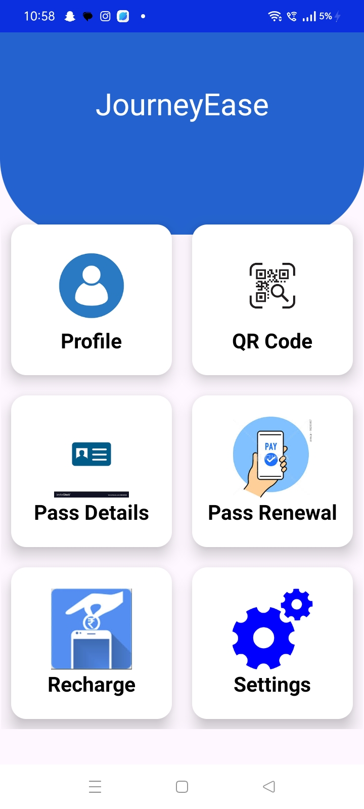

Digitalisation of bus pass system using QR code integration is a android application for  students to get bus passes online. Before this application implementation the manual process  is used to do the process of issuing the Bus pass to the students. This Manual process requires  manpower and more time consuming. The system is intended to develop an application to  perform functions like accessing basic information for authentication using QR codes and  providing passes without the need to wait in any queue. Online 13 bus pass generation system is  for students to get pass through online. We are providing the option to download a particular  pass or have a soft copy of pass and supervisor can check bus pass using QR code scanning.  This system shows the details of distance and respective price per period. We are using cloud  to host this website and to store the details. We are implementing this to avoid frauds in using  the same bus pass by more than one person and to make people easily renew their passes.  Additionally, this system allows normal people who travel on the buses to pay for the ticket  through the ecards issued. We aim to create a system where cashless payments are made easily.
**Please check the master branch for all the files**
\n

